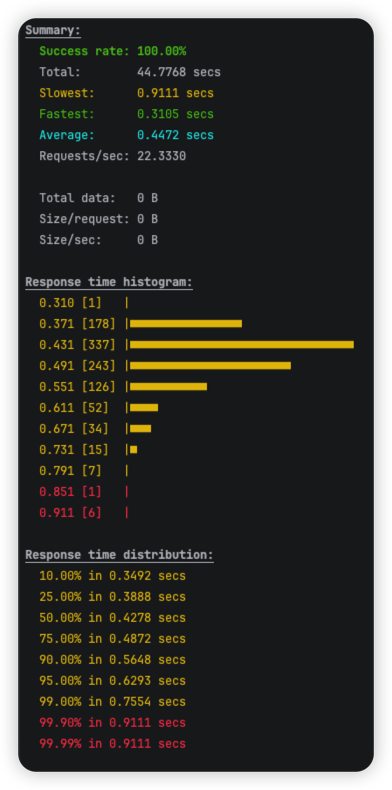
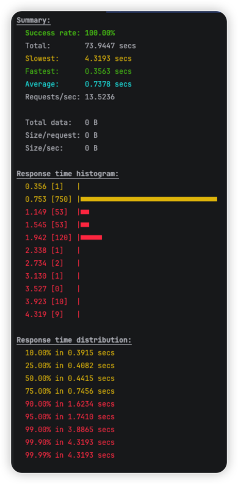
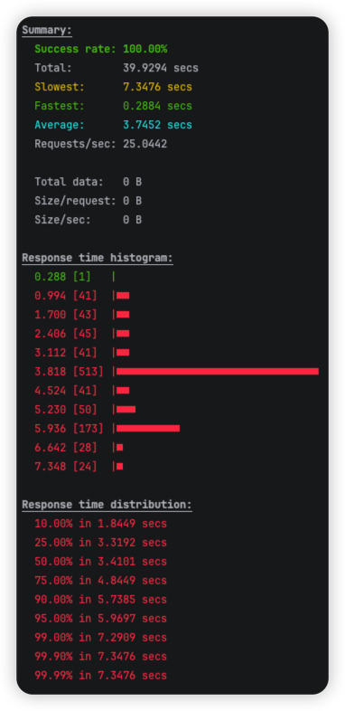
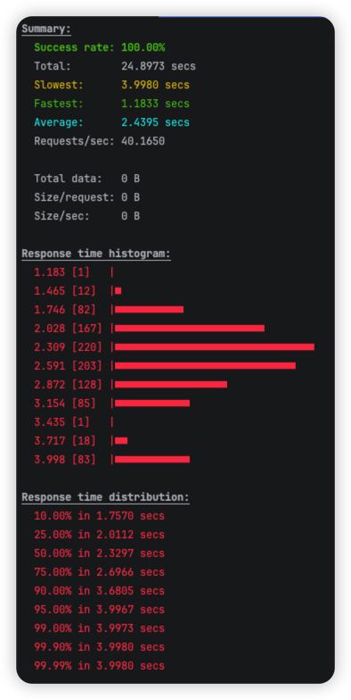
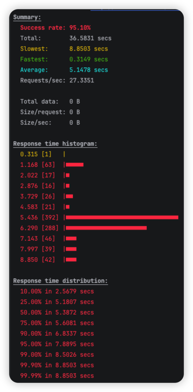
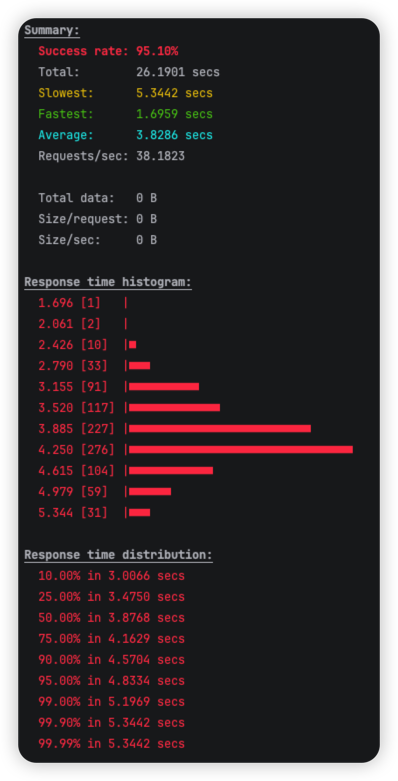
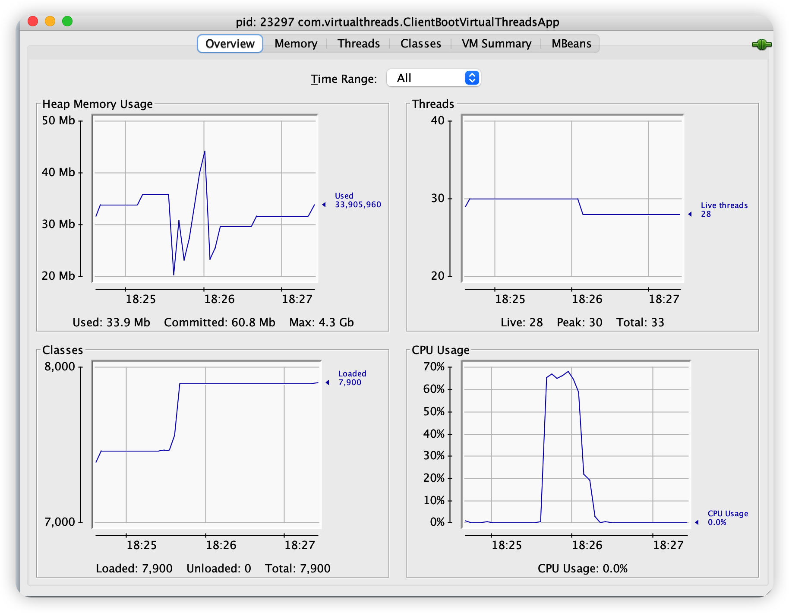
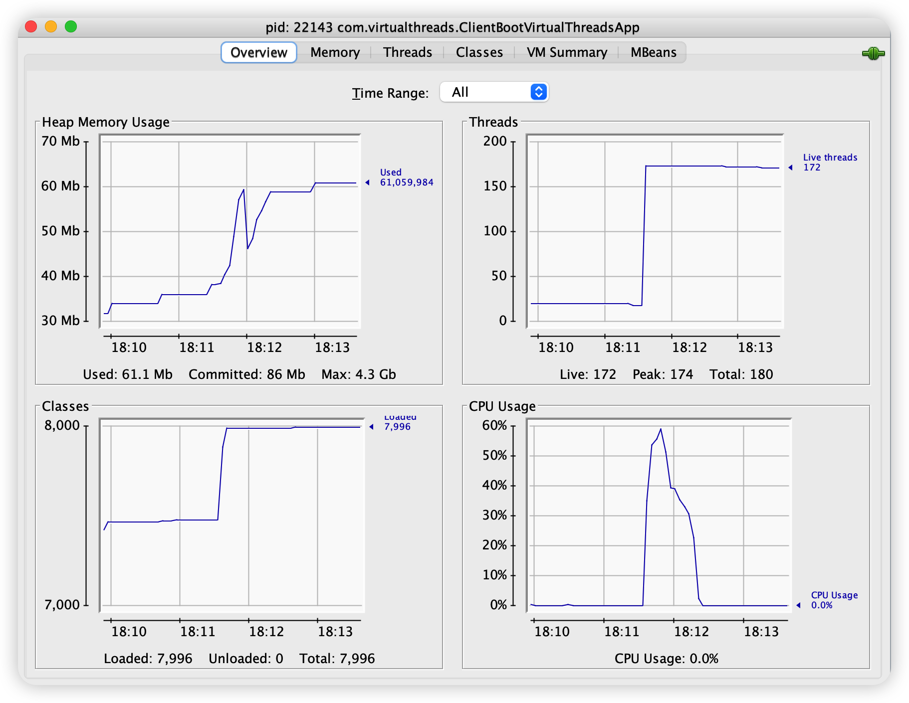

# 동시요청 부하 테스트
## SetUp

- 부하테스트 전 테스트 환경을 동일하게 주기 위해 업로드 요청시 저장되는 공간은 깨끗이 비어있도록 한다.
- 플랫폼스레드로 실행 시 최대 스레드 개수는 10개로 제한한다.

## Test 시나리오

- 1000 개의 요청에 대해 각각 동시 요청수를 늘려가며 테스트를 진행한다.

## 50MB 동영상 파일 업로드

### 10개의 동시요청으로 1000개의 요청

```java
oha -n 1000 -c 10 http://localhost:8080/resource/upload
```

| without virtualthread                                  | with virtualthread                                      |
|--------------------------------------------------------|---------------------------------------------------------|
|  |  |

- 결과
    - 가상스레드로 실행한 경우 1000개의 요청처리를 더 빨리 처리함
    - 플랫폼스레드에서는 가장 늦게 응답을 받은 경우 4초를 초과하는 경우가 발생한 거에 비해 가상스레드에서는 가장 늦게 응답을 받은 요청이 1초 미만임
        - 플랫폼 스레드는 처리를 오래하는 로직인 경우 요청을 대기하는 경우가 발생하므로 쓰레드 블록킹으로 동작한다고 볼수 있음
    - 파일 저장 로직 수행 시간 및 cpu 사용량
        - 플랫폼스레드로 수행한 경우 점점 요청을 처리할 수록 cpu 사용량이 70퍼를 웃돌면서 업로드 자체의 수행시간이 300 에서 11 밀리세컨으로 증가함
        - 가상스레드로 수행한 경우 cpu 사용량이 80퍼이고, 파 일일저장자의체수 시행행은 300 ~ 800 범위로 수행함
    - 업로드 요청이 가장 빨리 처리되는 것들의 분포를 보면 가상스레드가 0.371 로 응답하는 경우가 178개, 플랫폼스레드가 0.753으로 처리한게 750 으로 단일 파일 자체에 대한 업로드 처리도 가상스레드가 더 빠른것으로 보여짐
        - 이것은 단일 파일 대용량 업로드 요청으로 테스트가 필요해보임

### 100개의 동시요청으로 1000개의 요청

| without virtualthread                                    | with virtualthread                                     |
|----------------------------------------------------------|--------------------------------------------------------|
|  |  |

### 150개의 동시요청으로 1000개 요청

| without virtualthread                                             | with virtualthread                                                   |
|-------------------------------------------------------------------|----------------------------------------------------------------------|
|           |                |
|  |  |

- 결과
    - 동시요청수를 150개로 늘리면서 실패하는 응답이 발생함
        - 실패율은 플랫폼스레드가 더 높긴하지만 미세함
        - 커넥션 에러로 발생
    - 플랫폼스레드로 실행한 서버는 파일업로드 자체의 로직 수행시간은 311~610 밀리세컨드 범위 내에서 실행된 것으로 보아 요청들의 응답시간은 스레드가 10개가 다 수행되기 전까지 대기함으로써 발생한 것으로 해석할 수 있음
    - 가상스레드로 실행한 서버는 요청이 오자마자 모든 요청에 대한 스레드를 즉각 생성하여 업로드 로직을 실행시킴. 하지만 실제 파일 로컬 저장자의체수 시행행은 2초부터 9초까지로 플랫폼스레드로 실행한 서버의 업로드보다 10배정도 오래 걸리고, 힙메모리 영역 사용량이 월등히 높음


## 결론

- 가상스레드는 스레드 개수에 제한이 없기 떄문에 한번에 많은 요청이 들어와도 모든 요청은 파일 저장로직을 수행하게 된다. 동시요청에 대해 모두 파일 저장로직을 한번에 수행하게 되므로 CPU 사용량이 대체적으로 플랫폼스레드 서버보다 높고, 파일 저장 자체 수행시간은 더 오래 걸린다.
- 스레드 개수에 제한이 없기 때문에 cpu 사용량이 높이 오히려 성능 저하가 발생할 수 있고, 동시요청이 많아질 수록 힙메모리 사용량이 플랫폼스레드보다 1.5배 높은 것으로 보아 메모리 누수나 메모리 에러등이 발생할 수 있다 그러므로 동시성에 제한을 두는 처리가 필요하다.
- 플랫폼스레드는 로컬파일저장 자체는 빨리 수행하지만, 동시요청수가 많은 경우 특정 유저들에게 상당히 큰 대기 시간을 줄 수 있음
- 로컬 파일 저장에 대해 플랫폼 스레드보다 가상스레드가 약 2배 정도 좋은 성능을 보였다.