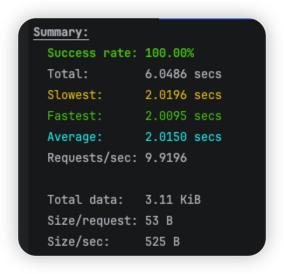

# Spring에서 가상스레드 사용하기
스프링부터 3.2부터 가상스레드를 공식적으로 지원

## 적용방법

### 방법1. 프로퍼티 추가

프로퍼티 값을 `true` 로 설정하면 스프링부트에서 가상스레드를 사용할 수 있다.

기존 플랫폼스레드에 동작하던 스프링을 가상스레드로 동작하도록 변경하기 위해서 단 한줄만으로 변경이 가능하다.

```json
spring.thread.virtual.enable=true
```

### 방법2. Spring3.2보다 낮은 버전인 경우 가상스레드 ExecutorBean 등록

```java
// Web Request 를 처리할 때 Virtual Thread를 사용하여 유입된 요청을 처리하도록 한다.
@Bean
public TomcatProtocolHandlerCustomizer<?> protocolHandlerVirtualThreadExecutorCustomizer() 
{
  return protocolHandler -> {
    protocolHandler.setExecutor(Executors.newVirtualThreadPerTaskExecutor());
  };
}

// Async Task에 Virtual Thread 사용
@Bean(TaskExecutionAutoConfiguration.APPLICATION_TASK_EXECUTOR_BEAN_NAME)
public AsyncTaskExecutor asyncTaskExecutor() {
  return new TaskExecutorAdapter(Executors.newVirtualThreadPerTaskExecutor());
}
```

## Spring Boot App

**Remote Service**

```java
curl -i http://localhost:8085/block/2
```

**Client Call to Remote Service**

```java
curl -i http://localhost:8080/block/2
```

## 성능테스트

### Set Up

**application.yml**

- 10개의 tomcat thread 로 요청을 핸들링

```java
server:
  tomcat:
    threads:
      max: 10
```

### 총 10개의 요청 - 동시에 10개 요청

- 10개의 요청이 동시에 동작한다.

```java
oha -n 10 -c 10 http://localhost:8080/block/2
```

### 총 20개의 요청 - 동시에 10개 요청

```java
oha -n 20 -c 10 http://localhost:8080/block/2
```

### 총 60개의 요청 - 동시에 20개 요청

```java
oha -n 60 -c 20 http://localhost:8080/block/2
```

### result

| without virtualthread                                 | with virtualthread                     |
|-------------------------------------------------------|----------------------------------------|
|  | |
|  | |
|  ||

* 60개의 요청을 동시에 20개씩 처리할 때 `Response time distribution`
  * without virtual thread
  ```
    10.00% in 2.0097 secs
    25.00% in 2.0140 secs
    50.00% in 4.0188 secs
    75.00% in 4.0545 secs
    90.00% in 6.0680 secs
    95.00% in 6.0681 secs
    99.00% in 6.0696 secs
    99.90% in 6.0696 secs
    99.99% in 6.0696 secs
  ```
  * with virtual thread
  ```
    10.00% in 2.0126 secs
    25.00% in 2.0148 secs
    50.00% in 2.0231 secs
    75.00% in 2.1629 secs
    90.00% in 2.1662 secs
    95.00% in 2.1665 secs
    99.00% in 2.1674 secs
    99.90% in 2.1674 secs
    99.99% in 2.1674 secs
  ```

### 결론
60개의 요청을 20개씩 동시에 처리할 때 `Response time distribution` 결과를 보면 가상스레드를 사용하지 않은 경우에
요청들이 계속 대기하고 있는 것을 확인할 수 있다. 가상스레드를 사용한 경우에는 대기시간 없이 바로바로 요청을 처리한다.
이로 보아, 가상스레드를 사용하면 blocking I/O 작업을 처리할 때 성능이 향상된다는 것을 확인할 수 있다.
