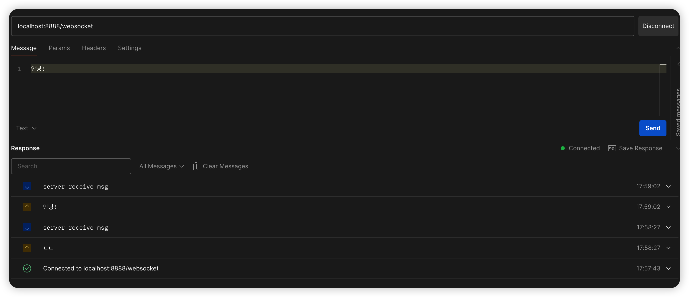

#  설명
- 웹소켓 연결을 핸들링 하는 웹소켓 서버

# 연결
- ws://localhost:8080/websocket 

# Postman 사용예시

# 참고
- [Spring Websocket](https://jxausea.medium.com/spring-boot-intergratd-netty-implements-websocket-communication-2302e09cf748)
- [github 참고예제](https://github.com/zhoumengkang/netty-websocket/tree/master/src/main/java/net/mengkang)