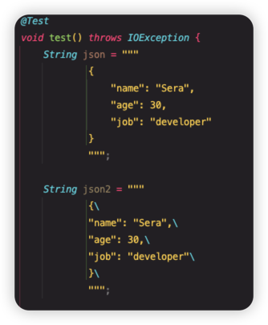

# 출처

이 글은 [최범균님의 자바 9-16](https://www.youtube.com/watch?v=7SlDdzVk6GE&t=0s)를 보고 정리한 내용입니다.

# Java 9

### 인터페이스에 private 메서드

- 인터페이스 내에서 코드를 재사용하고,유지보수를 쉽게 하기 위한 목적으로 도입됨
  예를 들면,인터페이스 내부에서 공통으로 사용하는 코드를 private method로 정의하여 반복을 줄일 수 있음

```java
public interface InterfaceInPrivateMethod {
    void exchange();
    default void get() {
        loggingStatic("this is static method");
        exchange();
        logging("this is private method");
    }
    private void logging(String message){
        System.out.println(message);
    }
    private static void loggingStatic(String message){
        System.out.println(message);
    }
}
```

### CollectionFatoryMethod

- 쉽게 List, Map 에 값을 할당하여 초기화할 수 있다.

```java
public void collectionFactoryMethod(){
	// 불변 Collection
  List<String> immutableList = List.of("a", "b", "c");
  // 빈 Collection
  List<String> emptyList = List.of();
  // 싱글턴 Collection
  List<String> singletonList = List.of("a");
  // 작은 Collection
  List<String> smallList = List.of("a", "b");
}
```

### try-with-resource 에 변수 사용

- java 8 에서는 try 안에 저렇게 변수를 넣으면 에러를 내뱉음 java 9에서는 try 밖에서 객체를 생성해서 try 안에 넣어도 에러를 뱉지 않는다. 코드가 간결해지는 이점을 얻을 수 있다

```java
private void readVersion8() throws FileNotFoundException {
	String file = "src/test/resources/fileTest.txt";
  String currentLine;
  BufferedReader reader = new BufferedReader(new FileReader(file));
  try (reader) {
	  currentLine = reader.readLine();
  } catch (IOException e) {
	  e.printStackTrace();
  }
}
```

# Java 11

- var 추가됨

### Files.writingString(), Files.readString()

```java

Files.writeString(Path.of("src/test/resources/fileTest2.txt"), "Hello, world Sera!!");
String fileString = Files.readString(Path.of("src/test/resources/fileTest2.txt"));
```

### String class 내부 편리한 함수 추가됨

```java
@Test
public void stringMethod(){
	String str = "  abc  ";
  boolean isBlank = str.isBlank();
  Stream<String> lines = str.lines();
  String strip = str.strip();
  String stripLeading = str.stripLeading();
  String stripTrailing = str.stripTrailing();
  String repeat = str.repeat(3);

  assertFalse(isBlank);
  assertEquals(lines.findFirst().get(), "  abc  ");
  assertEquals(strip, "abc");
  assertEquals(stripLeading, "abc  ");
  assertEquals(stripTrailing, "  abc");
  assertEquals(repeat, "  abc    abc    abc  ");
}
```

# Java 14

### switch 문 개선

```java
public String getGrade(int score) {
	return switch(score) {
		case 10 -> "A";
		case 9 -> "B";
		case 8 -> "C";
		case 7 -> "D";
		default-> "F";
    };
}
```

# Java 15

### 블록 띄어쓰기

- IDE 내부에서 변수 선언 하단에 초록색 새로줄로 띄어쓰기 라인이 적용된다.



### String formatted()

```java
@Test
public void stringFormattedMethod(){
	String old = String.format("name: %s, my-name: %s", "java", "sera");
  String v15 = "name: %s, my-name: %s".formatted("java", "sera");

  assertEquals(old, v15);
}
```

### 친절해진 NPE Messagek

- 상세하게 NPE 발생지점을 알려주어 트래킹 하기 쉽다
- 기존에는 name 이 null 인지, name.firstName 이 null 인지 NullPointerException 메세지에 적혀있지 않아서 디버깅을 하든, 로그를 찍어야 알 수 있었음

```java
@Test
public void handleNpeMessageTest() {
	Name name = new Name(null);
  String expected = "Cannot invoke \"String.toUpperCase()\" because the return value of \"version.version15.HandlingNPE$Name.getFirstName()\" is null";
  String npeMessage = null;
  try {
	  name.getFirstName().toUpperCase();
  } catch (NullPointerException e) {
	  npeMessage = e.getMessage();
  }
	  assertEquals(expected, npeMessage);
}
```

# Java 16

- record 클래스 타입 추가됨
- Stream 을 핸들링하기 쉬운 toList(), mapMulti() 가 추가됨

```java
@Test
public void handlingStream() {
	List<Integer> oldList = Stream.of(1, 2, 3).filter(n -> n % 2 == 0).collect(Collectors.toList());
  List<Integer> v16List = Stream.of(1, 2, 3).filter(n -> n % 2 == 0).toList();

  // 기존에는 flatMap 을 쓰고, 또 flatMap 안에서 생성하는 애가 Stream 이여야 했음
  List<Integer> oldUsingFlatMap = Stream.of(1, 2, 3)
		  .flatMap(n -> Stream.of(n, -n))
      .toList();

  List<Integer> v16 = Stream.of(1, 2, 3)
		  .mapMulti((Integer n, Consumer<Integer> consumer) -> {
	      consumer.accept(n);
        consumer.accept(-n);
      }).toList();

  assertEquals(List.of(1, -1, 2, -2, 3, -3), v16);
  assertEquals(oldUsingFlatMap, v16);
}
```